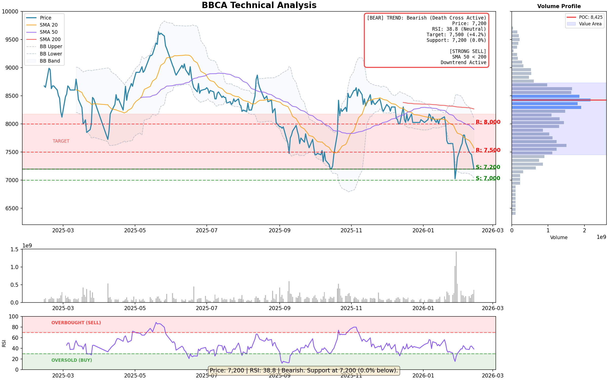

# 📈 IDX Stock Analyzer

<p align="center">
  
  
  
</p>

A powerful, user-friendly command-line tool for technical analysis of Indonesian stocks listed on the **Indonesia Stock Exchange (IDX)**. Get instant insights on support/resistance levels, trend analysis, moving averages, and actionable trading recommendations with beautiful visualizations.

---

## ✨ Features

- 🔍 **Smart Support & Resistance Detection** - Automatically identifies key price levels based on 52-week data and recent price action
- 📊 **Multi-Timeframe Trend Analysis** - SMA 20, 50, 200 with Golden/Death Cross detection
- 🎯 **Visual Trading Recommendations** - Clear buy/sell signals with risk/reward ratios
- 📈 **Enhanced Technical Charts** - Publication-ready charts with:
  - Support/Resistance levels
  - Moving averages (SMA 20/50/200)
  - **Bollinger Bands** (20-period, 2σ)
  - **Volume Profile** (POC, Value Area)
  - RSI indicator with overbought/oversold zones
  - Insight box with trend analysis
  - Visual buy/sell zones
- 📁 **Export Options** - Save analysis to CSV or JSON for further processing
- ⚡ **Fast & Lightweight** - Minimal dependencies, quick execution
- 🎨 **Beautiful CLI Output** - Color-coded, easy-to-read terminal output

---

## 📈 Chart Output Example

<p align="center">
  
</p>

*Example chart showing BBCA (Bank Central Asia) with Bollinger Bands, Volume Profile, SMA lines, RSI indicator, and support/resistance levels.*

---

## 🚀 Quick Start (5 Minutes)

### Prerequisites

- Python 3.13 or higher
- [UV](https://github.com/astral-sh/uv) package manager (recommended)

### Installation

```bash
# Clone the repository
git clone https://github.com/ceroberoz/IDX-Stock-Analyzer.git
cd IDX-Stock-Analyzer

# Install dependencies using UV
uv sync

# Verify installation
uv run idx-analyzer --version
```

> **Don't have UV?** Install it with: `curl -LsSf https://astral.sh/uv/install.sh | sh`

### Your First Analysis

```bash
# Analyze BBCA (Bank Central Asia)
uv run idx-analyzer BBCA

# Generate a chart
uv run idx-analyzer BBCA --chart

# Analyze with 1 year of data for better SMA 200 accuracy
uv run idx-analyzer BBCA --period 1y --chart
```

---

## 📖 Understanding the Output

### Terminal Output

```
╔══════════════════════════════════════════════════════════════╗
║ IDX Stock Analysis:                    BBCA                    ║
╚══════════════════════════════════════════════════════════════╝

💰 Current Price:        7,200 IDR
   Daily Change:  🔴      -1.71%
   Volume:         356,015,300

━━━━━━━━━━━━━━━━━━━━━━━━━━━━━━━━━━━━━━━━━━━━━━━━━━━━━━━━━━━━
📊 52-WEEK RANGE
━━━━━━━━━━━━━━━━━━━━━━━━━━━━━━━━━━━━━━━━━━━━━━━━━━━━━━━━━━━━
   High:      9,736  (-26.0% from current)
   Low:       6,375  (+12.9% from current)

━━━━━━━━━━━━━━━━━━━━━━━━━━━━━━━━━━━━━━━━━━━━━━━━━━━━━━━━━━━━
🟢 SUPPORT LEVELS (Buy Zones)
━━━━━━━━━━━━━━━━━━━━━━━━━━━━━━━━━━━━━━━━━━━━━━━━━━━━━━━━━━━━
   1.    7,200  (  0.0% below)  ▪ moderate
   2.    6,375  ( 11.5% below)  ⭐ strong

━━━━━━━━━━━━━━━━━━━━━━━━━━━━━━━━━━━━━━━━━━━━━━━━━━━━━━━━━━━━
🔴 RESISTANCE LEVELS (Sell/Target Zones)
━━━━━━━━━━━━━━━━━━━━━━━━━━━━━━━━━━━━━━━━━━━━━━━━━━━━━━━━━━━━
   1.    7,500  (+  4.2% above)  • weak
   2.    9,736  (+ 35.2% above)  ⭐ strong

━━━━━━━━━━━━━━━━━━━━━━━━━━━━━━━━━━━━━━━━━━━━━━━━━━━━━━━━━━━━
📊 MOVING AVERAGES
━━━━━━━━━━━━━━━━━━━━━━━━━━━━━━━━━━━━━━━━━━━━━━━━━━━━━━━━━━━━
   SMA 20:      7,569  🔴 -4.9%
   SMA 50:      7,901  🔴 -8.9%
   SMA 200:     8,265  🔴 -12.9%

━━━━━━━━━━━━━━━━━━━━━━━━━━━━━━━━━━━━━━━━━━━━━━━━━━━━━━━━━━━━
📈 Trend: 🐻 Bearish (Death Cross Active)

💡 RECOMMENDATION:
   Bearish. Support at 7,200 (0.0% below).
```

### Understanding Moving Averages

| MA | Period | What It Tells You |
|----|--------|-------------------|
| **SMA 20** | 20 days | Short-term trend direction |
| **SMA 50** | 50 days | Medium-term trend strength |
| **SMA 200** | 200 days | Long-term trend / major support-resistance |

**Golden Cross**: SMA 50 crosses above SMA 200 → **Bullish signal** 📈  
**Death Cross**: SMA 50 crosses below SMA 200 → **Bearish signal** 📉

### Reading the Chart

The generated chart includes an **Insight Box** (upper right) showing:
- Current trend with visual indicator
- Key price levels (support/resistance)
- RSI status (Overbought/Oversold/Neutral)
- Risk/Reward ratio
- Clear action recommendation:
  - **[STRONG BUY]** - Golden Cross active
  - **[STRONG SELL]** - Death Cross active
  - **[BUY ZONE]** - Above key MAs
  - **[SELL ZONE]** - Below key MAs
  - **[OVERBOUGHT]** - RSI > 70
  - **[OVERSOLD]** - RSI < 30

---

## 🛠️ Command Reference

```bash
uv run idx-analyzer <TICKER> [OPTIONS]
```

### Options

| Option | Short | Description | Example |
|--------|-------|-------------|---------|
| `--period` | `-p` | Historical data period | `--period 1y` |
| `--export` | `-e` | Export format (csv/json) | `--export json` |
| `--output` | `-o` | Custom output filename | `--output my_analysis.json` |
| `--chart` | `-c` | Generate technical chart | `--chart` |
| `--chart-output` | | Custom chart filename | `--chart-output bbc.png` |
| `--config` | | Custom configuration file | `--config myconfig.toml` |
| `--init-config` | | Create default config file | `--init-config` |
| `--quiet` | `-q` | Minimal output for scripting | `--quiet` |
| `--version` | `-v` | Show version | `--version` |

### Period Options

- `1mo` - 1 month
- `3mo` - 3 months
- `6mo` - 6 months (default)
- `1y` - 1 year (recommended for SMA 200)
- `2y` - 2 years
- `5y` - 5 years

### Usage Examples

```bash
# Basic analysis
uv run idx-analyzer BBCA

# Analyze with 1 year data and generate chart
uv run idx-analyzer BBRI --period 1y --chart

# Export to JSON
uv run idx-analyzer TLKM --export json --output tlkm_analysis.json

# Batch analysis (scripting mode)
uv run idx-analyzer ASII --quiet

# Custom chart filename
uv run idx-analyzer UNVR -c --chart-output unvr_chart.png

# Create default configuration file
uv run idx-analyzer BBCA --init-config

# Use custom configuration file
uv run idx-analyzer BBCA --config myconfig.toml
```

---

## ⚙️ Configuration File

IDX Analyzer supports TOML configuration files for customizing default behavior.

### Configuration Locations

The tool looks for config files in this order:
1. Path specified with `--config`
2. `~/.config/idx-analyzer/config.toml`
3. `~/.idx-analyzer.toml`
4. `./idx-analyzer.toml` (current directory)

### Example Configuration

```toml
[analysis]
default_period = "6mo"        # Default: 6mo, Options: 1mo, 3mo, 6mo, 1y, 2y, 5y
rsi_window = 14               # RSI calculation period
sma_windows = [20, 50, 200]   # SMA periods
bb_window = 20                # Bollinger Bands window
bb_std = 2.0                  # Bollinger Bands standard deviations
vp_bins = 50                  # Volume Profile bins

[network]
timeout = 30                  # Request timeout (seconds)
max_retries = 3               # Number of retries for failed requests
retry_delay = 1.0             # Initial retry delay (seconds)
use_cache = true              # Enable request caching
cache_ttl = 300               # Cache TTL (seconds)

[chart]
dpi = 150                     # Chart resolution
width = 16                    # Chart width (inches)
height = 10                   # Chart height (inches)
style = "default"             # Matplotlib style
show_grid = true              # Show grid lines

[display]
color_output = true           # Enable colored terminal output
verbose = false               # Verbose output mode
```

### Creating a Config File

```bash
# Create default config at ~/.idx-analyzer.toml
uv run idx-analyzer BBCA --init-config

# Or copy the example and customize
cp idx-analyzer.toml.example ~/.idx-analyzer.toml
```

---

## 📋 Supported Stocks

Any stock listed on the Indonesia Stock Exchange (IDX). Use the ticker symbol without the `.JK` suffix.

### Popular Tickers by Sector

| Sector | Tickers |
|--------|---------|
| **Banking** | BBCA, BBRI, BMRI, BBNI, BRIS |
| **Telco** | TLKM, ISAT, EXCL, FREN |
| **Consumer** | UNVR, ICBP, MYOR, GGRM, KAEF |
| **Mining** | ADRO, ITMG, PTBA, ANTM, INCO |
| **Property** | SMRA, PWON, CTRA, BSDE, APLN |
| **Infrastructure** | ASII, JSMR, CMNP, JPFA |
| **Technology** | GOTO, BELI, BUKA, MCAS |

> **Tip:** You can also use `IDX:` prefix (e.g., `IDX:BBCA`)

---

## 🔧 Advanced Usage

### Python API

```python
from idx_analyzer.analyzer import IDXAnalyzer

# Create analyzer
analyzer = IDXAnalyzer("BBCA")

# Fetch data
analyzer.fetch_data(period="1y")

# Get analysis
result = analyzer.analyze()

# Access results
print(f"Price: {result.current_price}")
print(f"Trend: {result.trend}")
print(f"RSI: {result.rsi}")

# Generate chart
chart_path = analyzer.generate_chart(output_path="my_chart.png")
```

### Batch Analysis Script

```bash
#!/bin/bash
# analyze_portfolio.sh

STOCKS=("BBCA" "BBRI" "TLKM" "ASII" "UNVR")

for stock in "${STOCKS[@]}"; do
    echo "=== $stock ==="
    uv run idx-analyzer "$stock" --quiet
    echo ""
done > portfolio_analysis.txt
```

See `examples/` folder for more scripts.

---

## 📁 Project Structure

```
idx-analyzer/
├── idx_analyzer/          # Main package
│   ├── __init__.py
│   ├── analyzer.py        # Core analysis logic
│   └── cli.py            # Command-line interface
├── examples/              # Usage examples
│   ├── basic_usage.py
│   └── batch_analysis.sh
├── charts/               # Generated charts (gitignored)
├── tests/                # Test files
├── docs/                 # Documentation
├── .gitignore           # Git ignore rules
├── LICENSE              # MIT License
├── pyproject.toml       # Project configuration
├── README.md           # This file
└── uv.lock            # Lock file (optional)
```

---

## 🤝 Contributing

Contributions are welcome! Please see [CONTRIBUTING.md](CONTRIBUTING.md) for guidelines.

### Quick Development Setup

```bash
# Clone repo
git clone https://github.com/ceroberoz/IDX-Stock-Analyzer.git
cd IDX-Stock-Analyzer

# Install with dev dependencies
uv sync

# Run tests (when available)
uv run pytest

# Format code
uv run ruff format .

# Lint code
uv run ruff check .
```

---

## 🐛 Troubleshooting

### Common Issues

**"Invalid or unknown ticker"**
- Check the ticker spelling (e.g., 'BBCA' not 'BB CA')
- Use the stock code without '.JK' suffix
- Verify the stock is listed on IDX
- Try: BBCA, BBRI, TLKM, ASII, UNVR

**"Could not fetch data" / Network errors**
- Check your internet connection
- Yahoo Finance may be temporarily unavailable
- The tool will automatically retry up to 3 times
- Try again in a few moments

**"Insufficient data"**
- Try a longer period: `--period 1y` or `--period 2y`
- The stock may be newly listed
- Try a different ticker

**"Module not found"**
```bash
# Reinstall dependencies
uv sync
```

**Charts not generating**
- Ensure you have write permissions in the directory
- Try specifying a full path: `--chart-output /path/to/chart.png`
- Check that you have sufficient disk space

---

## 📊 Technical Analysis Explained

### Support & Resistance
- **Support**: Price level where buying pressure overcomes selling pressure
- **Resistance**: Price level where selling pressure overcomes buying pressure
- **52-week high/low**: Strong psychological levels

### RSI (Relative Strength Index)
- **> 70**: Overbought (potential sell signal)
- **< 30**: Oversold (potential buy signal)
- **30-70**: Neutral zone

### Moving Averages Strategy
1. **Price > SMA 20 > SMA 50 > SMA 200**: Strong uptrend (Bullish)
2. **Price < SMA 20 < SMA 50 < SMA 200**: Strong downtrend (Bearish)
3. **Golden Cross** (50 crosses above 200): Long-term buy signal
4. **Death Cross** (50 crosses below 200): Long-term sell signal

---

## 🙏 Credits & Acknowledgments

### Data Providers
- **[Yahoo Finance](https://finance.yahoo.com/)** - Real-time and historical stock data
- **[yfinance](https://github.com/ranaroussi/yfinance)** - Python library for Yahoo Finance data

### Tools & Libraries
- **[UV](https://github.com/astral-sh/uv)** - Fast Python package installer and resolver
- **[Pandas](https://pandas.pydata.org/)** - Data manipulation and analysis
- **[NumPy](https://numpy.org/)** - Numerical computing
- **[Matplotlib](https://matplotlib.org/)** - Data visualization
- **[Ruff](https://github.com/astral-sh/ruff)** - Fast Python linter and code formatter
- **[tomli-w](https://github.com/hukkin/tomli-w)** - TOML configuration file support

### AI Assistance
This project was developed with assistance from:
- **Sisyphus (AI Agent)** - Architecture, implementation, and enhancement suggestions
- **OpenCode** - AI-powered development environment

The AI helped with:
- SMA 50/200 implementation and trend analysis logic
- Chart enhancement with insight boxes and visual zones
- Error handling system with custom exceptions and retry logic
- Configuration file support with TOML format
- Code organization and best practices
- Documentation structure

---

## 📄 License

This project is licensed under the **MIT License** - see [LICENSE](LICENSE) file for details.

---

## 💬 Support & Community

- **Issues**: [GitHub Issues](https://github.com/ceroberoz/IDX-Stock-Analyzer/issues)
- **Discussions**: [GitHub Discussions](https://github.com/ceroberoz/IDX-Stock-Analyzer/discussions)

---

## 🗺️ Roadmap

- [x] Add Bollinger Bands indicator ✅
- [x] Volume profile analysis ✅
- [x] Error handling improvements ✅
- [x] Configuration file support ✅
- [ ] Backtesting module
- [ ] Web interface
- [ ] Price alerts (email/webhook)
- [ ] More export formats (Excel, PDF)

---

<p align="center">
  <b>Happy Trading! 📈🚀</b>
</p>

<p align="center">
  <sub>Built with ❤️ for the Indonesian trading community</sub>
</p>
